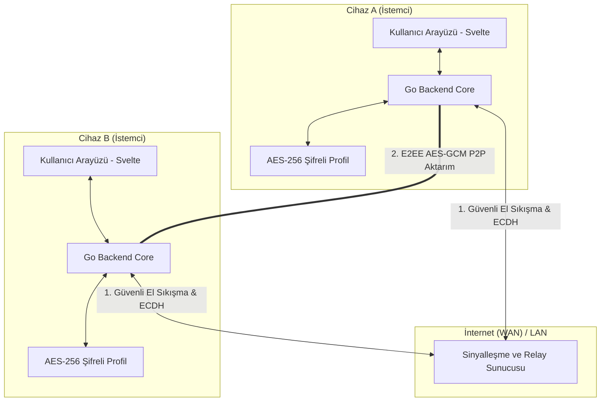

# 🛡️ QBFile - Uçtan Uca Şifreli (E2EE) P2P Dosya Aktarım ve Sohbet Sistemi

🌍 [English Version](README.md)

[](https://opensource.org/licenses/Apache-2.0)
[](https://golang.org)
[](https://svelte.dev)
[](https://wails.io)

QBFile; hem yerel ağlarda (LAN) hem de internet üzerinde (WAN) sıfır-bilgi (zero-knowledge) gizlilik prensibiyle çalışan, yüksek performanslı, **Uçtan Uca Şifreli (E2EE) eşler arası (P2P) dosya aktarım ve anlık mesajlaşma** uygulamasıdır. 

---

## 💎 Temel Özellikler

### 🔒 1. Üst Düzey Güvenlik ve Kriptografi
* **Uçtan Uca Şifreleme (E2EE)**: Tüm dosya aktarımları ve mesajlar, eliptik eğri Diffie-Hellman (**ECDH - Curve25519**) anahtar anlaşması ve **256-bit AES-GCM** simetrik şifreleme algoritması ile cihazlar arasında doğrudan şifrelenir.
* **Şifreli Yerel Profil**: Kullanıcı isimleri, durum mesajları ve arkadaş listeleri yerel diskte **AES-256-GCM** ile şifrelenmiş olarak saklanır. Şifre çözülmeden hiç kimse yerel profilinize erişemez.
* **Sıfır-Bilgi Sinyalleşmesi**: Çöpçatan (matchmaking) sunucusu aktarılan dosyaları veya mesajları **asla göremez, kaydedemez veya araya giremez**. Sadece bağlantıyı koordine eder.

### 👥 2. Kriptografik Arkadaş Yönetim Sistemi (Gizlilik Kalkanı)
* **Yabancı Engelleme (Strangers Filtered)**: Matchmaking sunucusuna bağlı olsanız bile, **birbirinizin 22 karakterlik benzersiz Peer ID'sini eklemediğiniz sürece** kimse sizi göremez veya sizinle iletişime geçemez.
* **Gelişmiş Keşif Filtresi**: Ağ paketleri arka planda süzülerek sadece izin verdiğiniz kriptografik açık anahtarlara (Public Key) sahip peer'ların çevrimiçi durumları arayüze yansıtılır.
* **Çevrimdışı Bellek**: Eklediğiniz arkadaşlar ağda olmasalar bile "Çevrimdışı" statüsüyle arayüzde listelenmeye devam eder; böylece geçmiş konuşmaları her an okuyabilirsiniz.

### 📂 3. Ultra Hızlı P2P Dosya ve Klasör Transferi
* **Büyük Dosya Desteği**: Dosyalar bellek dostu chunk'lara (parçalara) bölünerek soketler üzerinden yüksek hızda akar.
* **Klasör Sıkıştırma (Zip)**: Klasör gönderimlerinde sistem arka planda klasörü otomatik olarak sıkıştırıp gönderir ve alıcı tarafta şifreyi çözerek klasör hiyerarşisini bozmadan çıkarır.
* **Gelişmiş Kontrol**: Dosya transferlerini dilediğiniz an duraklatabilir (pause), devam ettirebilir (resume) veya iptal edebilirsiniz.

### 🎨 4. Premium Arayüz ve Kullanıcı Deneyimi (UI/UX)
* **Glassmorphism Arayüzü**: Buzlu cam efektleri (backdrop blur), premium renk geçişleri ve akıcı mikro animasyonlar ile göz alıcı karanlık mod tasarımı.
* **Renk Paletleri**: Kişiselleştirilebilir neon yeşili, siber mavi, mor, altın ve sakura pembesi gibi 5 farklı premium vurgu rengi seçeneği.
* **Dil Desteği**: Türkçe ve İngilizce dilleri arasında dinamik olarak geçiş yapabilen çok dilli yapı.

---

## 🏗️ Sistem Mimarisi



---

## 🛠️ Kurulum ve Derleme Kılavuzu

### Gereksinimler
* **Go** (v1.21 veya üzeri)
* **Node.js** (v18 veya üzeri)
* **Wails CLI** (Kurulum için: `go install github.com/wailsapp/wails/v2/cmd/wails@latest`)

### 1. Canlı Geliştirme Modu (Live Dev)
Uygulamayı geliştirme modunda çalıştırmak ve anlık arayüz güncellemelerini görmek için:
```bash
cd qbfile
wails dev
```

### 2. Üretim Sürümü (Production Build)
Uygulamayı tek bir taşınabilir (portable) Windows çalıştırılabilir dosyasına (`.exe`) dönüştürmek için:
```bash
wails build
```

---

## 🛡️ Güvenli Dağıtım ve Özel Sunucu Gömme

Projeyi GitHub'da açık kaynak olarak paylaşırken **kendi sunucunuzun IP adresini ifşa etmemek** ve arkadaşlarınızın ek bir ayar yapmadan doğrudan sunucunuza bağlanmasını sağlamak için harika bir Go Linker özelliği kullanılmaktadır:

Derleme yaparken terminalde kendi IP adresinizi şu şekilde parametre olarak geçebilirsiniz:
```bash
wails build -ldflags "-X main.DefaultWANServer=SUNUCU_IP_ADRESINIZ:12130"
```
Bu komut, kaynak kodunuzdaki generic localhost IP'sini değiştirmeden, sadece üretilen `.exe` dosyasına sunucu adresinizi gömer. Kodlarınız GitHub'da %100 temiz kalır!

---

## 📜 Lisans

Bu proje **Apache License 2.0** ile lisanslanmıştır. Detaylar için [LICENSE](LICENSE) dosyasına göz atabilirsiniz.

---

## 🤝 Katkıda Bulunanlar

* **Geliştirici / Proje Sahibi**: [tommyvercetti89](https://github.com/tommyvercetti89)
* **Yapay Zeka Mimarı**: Bu proje, **Antigravity** (Google Deepmind ekibi tarafından geliştirilen gelişmiş yapay zeka asistanı) iş birliği ile tasarlanmış ve kodlanmıştır.
